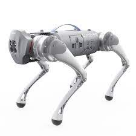
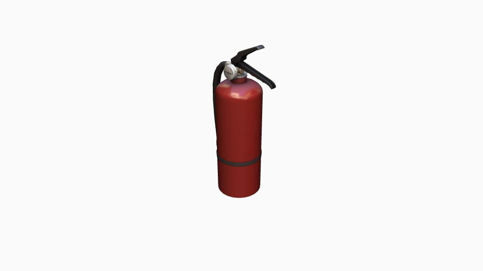

# ERF Dog Challenge simulation framework

- Version 1.0.0

---

<div style="display:flex;">
<div style="flex:50%; padding-right:10px; border-right: 1px solid #dcdde1">

**Package summary**

A repository for ERF DOG Challenge. Used for build, test, and deployment for both the Navigation Track and the Locomotion Track 

- Maintainer status: maintained
- Maintainers
  - Michele Focchi
  - Gennaro Raiola
  - Andrea Pupa


</div>
<div style="flex:40%; padding-left:10px;">

**Table of Contents**
- [Overview](#overview)
- [Installation Steps](#installation-steps)

</div>
</div>

---

## Overview


This repository provides framework and the URDF for the challenge for simulation 

- You can find detailed informations about the challenge on the <a href="docs/rule.md">rule page </a>
- The supported robot for this simulation is Go1 from Unitree robotics. A real prototype of the robot (EDU version) is provided from EagleProjects to the teams that might need it. 




---

## Usage of the framework

### Navigation 

For the teams that are enrolled in the navigation track, we provide a simulation framework.  To use it we provide a framework designed by Gennaro Raiola called <a href="https://github.com/graiola/wolf-setup.git">Wolf </a> .

- Before downloading the framework you need to install docker.


```
$ ./scripts/install_docker.sh
```

- To use the framework you need just to launch this script in the root folder of this repository:


```
$./start_framework.sh
```

The first time you call this script it will take a bit longer (~5 minute) because it is going to download  a docker image with  the framework's  code and its dependencies. This image will be downloaded locally. Then, the script spawns the Go1 robot into a maze that will be very similar to the one that you will find at the challenge. 

You can use the script argument `start_framework.sh -w ...` to select and load another .world file, located in the world folder, please check the help options for details.

```bash
$./start_framework.sh -w [e.g. locomotion]
```

The goal of this challenge is to explore a maze and detect artifacts (e.g. a fire extinguisher) in the shortest time possible and correctly report where these artifacts are located. In order to do this, you need to first to develop:

1. An accurate mapping and localization (SLAM) framework that tells us where we are.

2. A perception system that can recognize artifacts. The first object you need to find is a fire extinguisher as in the picture

    

The control of  a  team encompasses the access to each robot's sensors and actuators. The framework provides you access to the odometry and the perception capabilities of the robot to get information on the environment.

#### Sensors:

Each sensor publishes data over a ROS topic. Here's a summary of the topics used by each sensor type.

| Sensor type                               | Specification                                                |
| ----------------------------------------- | ------------------------------------------------------------ |
| Robosense RS-LiDAR-16                     | miniature LiDAR with a range of 150m and an accuracy of 2cm. 16 laser/detector pairs that rapidly spin, sending out high-frequency laser pulses. |
| IMU                                       | 3-axis accelerometer and gyroscope                           |
| 5 sets of fisheye binocular depth sensing | Single depth camera lens angle 150*170                       |


There are 5 stereo-cameras on 5 sides of the robot (face,left,right,chin,rearDown). A **LiDAR** sensor is located on the top of the robot. The sensors publish on the following topics (Gennaro check):

| ROS Topic             | Description                          | Message type                                                 |
| --------------------- | ------------------------------------ | ------------------------------------------------------------ |
| ``/joint_state``      | Joint angles [rad] and rates [rad/s] | [sensor_msgs/JointState](http://docs.ros.org/api/sensor_msgs/html/msg/JointState.html) |
| ``/point_cloud_left`` | Point Cloud                          | [sensor_msgs/PointCloud2](http://docs.ros.org/en/melodic/api/sensor_msgs/html/msg/PointCloud2.html) |
| `/point_cloud_right`  | Point Cloud                          | [sensor_msgs/PointCloud2](http://docs.ros.org/en/melodic/api/sensor_msgs/html/msg/PointCloud2.html) |
| `/point_cloud_front`  | Point Cloud                          | [sensor_msgs/PointCloud2](http://docs.ros.org/en/melodic/api/sensor_msgs/html/msg/PointCloud2.html) |
| ``/point_cloud_back`` | Point Cloud                          | [sensor_msgs/PointCloud2](http://docs.ros.org/en/melodic/api/sensor_msgs/html/msg/PointCloud2.html) |
| ``/rslidar_points``   | Point Cloud                          | [sensor_msgs/PointCloud2](http://docs.ros.org/en/melodic/api/sensor_msgs/html/msg/PointCloud2.html) |

The second step is to develop a planning algorithm that provides the robot with the ability to navigate and move the robot in the environment. The Wolf simulation framework provides a combination of ROS and C++  interfaces to manage these tasks. This section explains these interfaces grouped by type.

The Wolf Framework implements velocity controllers. They accept `Twist` messages and continuously publish `Odometry` messages. With this interface, you should be able to command linear and angular velocities to each robot and get its current position  estimation. The velocities are expressed in the body frame of the robot. Once the map and the robot are loaded, you can standup the robot by pressing the `enter` key on the virtual keyboard.
You can use this virtual keyboard to move the robot around. 

To send twist commands (and receive Odometry messages) to the robot you need to use the following topics:

| ROS Topic                | Description     | Message type                                                 |
| ------------------------ | --------------- | ------------------------------------------------------------ |
| `/wolf_controller/twist` | Target velocity | [geometry_msgs/Twist](http://docs.ros.org/api/geometry_msgs/html/msg/Twist.html) |
| `/go1/odom`              | Odometry        | [nav_msgs/Odometry](http://docs.ros.org/melodic/api/nav_msgs/html/msg/Odometry.html) |

**IMPORTANT:**

The topics are broadcasted back and forth from the docker image to your host machine. If you have ROS installed on your machine just open another terminal and do a test running:

```bash
$ rostopic pub /wolf_controller/twist geometry_msgs/Twist -r 1 -- '[2.0, 0.0, 0.0]' '[0.0, 0.0, 0.]'
```

You should see that the robot starts walking in a straight line in the maze.

If you do not have ROS installed in your host machine, you need to install docker launching this <a href="https://github.com/graiola/wolf-setup/blob/master/support/install_docker.sh">Docker install script </a> .

Then open a terminal and run:

```bash
$ docker exec -it wolf-app  /bin/bash
```

Now you are inside the docker environment and you can run your nodes (e.g. lauch the rostopic test script). 

To develop your own code create a ROS workspace folder (e.g. $HOME/ros_ws) and pass it as an argument to the start_framework script with the -v flag setting you local development code folder (e.g. $HOME/ros_ws) :  

```bash
$ ./start_framework.sh -v $HOME/ros_ws
```

the folder that will be automatically mounted and visible to docker if you run:

```bash
$ docker exec --workdir /home/root -it wolf-app  /bin/bash
```


### **Locomotion**

The map with of the race (with obstacles) is with the **locomotion.world** file. You can download and check map overview from <a href="docs/infographics.pdf" download>here</a>. 

The goal is to overpass all obstacles and reach the final destination in the shortest time possible. For details on the rule of the game, refer to the <a href="docs/rules.md">rule page </a> If you want to use the Go1 robot you can use this  [URDF description](https://github.com/graiola/wolf_descriptions). For any clarification please open a Github issue on this repository. 

The obstacles are of different nature and are designed to test different robot capabilities:

1. Stairs
2. Gap 
3. Narrow passage
4. Cluttered passage: the robot needs to walk belly down to pass underneath 
5. Holes in the terrain
6. Stepping Stones
7. Pile of rubble
8. Soft foam/ deformable terrain
9. Big ramps with change of inclination
10. Omni-directional small ramps

To load (in a Gazebo simulator) the  map contained in **worlds/locomotion/locomotion.world**: 

- Append these commands in your .bashrc

```
export GAZEBO_MODEL_PATH=$GAZEBO_MODEL_PATH:$HOME/DogChallengeFolder/models
export GAZEBO_PLUGIN_PATH=$GAZEBO_PLUGIN_PATH:$HOME/DogChallengeFolder/plugins/lib
export GAZEBO_RESOURCE_PATH=$GAZEBO_RESOURCE_PATH:$HOME/DogChallengeFolder/worlds
```

where **DogChallengeFolder** is the folder where you cloned this repository

- Spawn Gazebo simulation with this command:

```bash
roslaunch dog_challenge locomotion.launch
```

In this version, we only provide a method to import an SDF environment in a gazebo simulation. Alternatively, you can use your own framework and code to load the map model.

 

