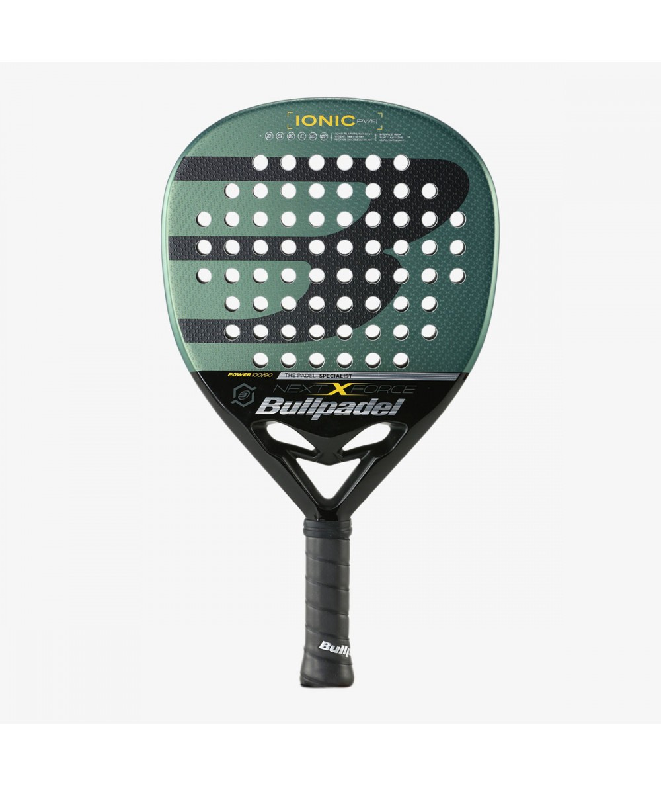

# ERF Dog Challenge Rule
The Dog Challenge consists of two "sub-challenges.": *Locomotion* and *Navigation*.

A team can participate to only one of the two sub-challenges.
If a team participates in both challenges, their ultimate ranking will be determined by the total score they earn in both sub-challenges. 
The winner of each sub-challenge will win a prize of 1.000 €, while the winner of the toatl challenge (the team with the higher ranking) will win a Unitree Go1 Edu.

If a team participates in both challenges, their ultimate ranking will be determined by the total score they earn in both sub-challenges. 

For the Navigation Track (challenge 2), the final score is calculated by summing the points earned for each object, with the objective difficulty in the object detection determining the number of points received. The time taken to complete the task will also be evaluated.

In the case of the Navigation track (challenge 2), the robot is meant to be tele-operated. However, if the robot successfully completes the challenge in a fully autonomous manner, a x2 score multiplication factor will be applied. The score for each obstacle is determined based on its objective difficulty. The time to accomplish the task will also be an evaluation factor.  

 **Challenge 1 (Locomotion Track).** 

The aim of this challenge is to test the robot's ability to navigate various obstacles from  a point A to point B along a designated path.

* The arena is enclosed by walls, preventing the robot from exiting. 

* Participants are provided with a 3D map of the arena when they enrol in the challenge.

* There is a predefined path to follow that involves overcoming obstacles of different levels of difficulty. 

* Some obstacles like stepping stones, debris, and pieces of furniture, are strategically distributed to challenge the robot’s ability to navigate.

* Other obstacles include stairs, ramps with different slopes, tunnels, slippery terrain, and soft terrain (such as foam). Some obstacles require specific abilities, such as crawling under a low bar or jumping over a high step.

* A score is associated to each obstacle (see https://github.com/ERF2024/dog_challenge/blob/master/docs/obstacle_scores.md)

* The judging committee will evaluate the percentage of completion of each task (0% up to full score)

* The scores of the overcome obstacles will be accumulated; if an obstacle is skipped the team receive 0 score

* If the robot falls there is no penalty if it is able to self-right itself. If the robot is not able to self-right itself, it needs to restart from the beginning of the obstacle.

* Everytime the robot touches the walls, a penalty of 1 point is given. 

* The judging committee reserves the right to stop any team’s attempt if considered dangerous or not following the guidelines. 

 **Challenge 2 (Navigation Track).** 

The objective is to explore an unknown maze environment in order to find given objects, in the shortest time possible. The robots will operate within a designated area of a maximum of 100 square meters, characterized by the following conditions:

* The maze is enclosed by walls, preventing the robot from exiting. No map of the maze will be disclosed to the participants that will have to implement their own exploration strategy. 

* The maze floor can be cluttered with moderate obstacles. 

* Four artifacts will be hidden in the maze to be discovered. The artifacts to be detected are:

* 2 unkown objects that are part of the COCO Dataset [https://cocodataset.org/#explore](https://cocodataset.org/#explore).

* A fire extinguisher

  

* The padel racket "Bullpadel Ionic Power 2022"

  

In order to do this, you need to first to develop:

1. An accurate mapping and localization (SLAM) framework that tells us where we are.

* Throughout the competition, each robot is allotted a fixed time (to be defined) to locate all objects within the arena. The robot that successfully finds the most objects or locates all objects in the shortest time will be declared the winner.

 
